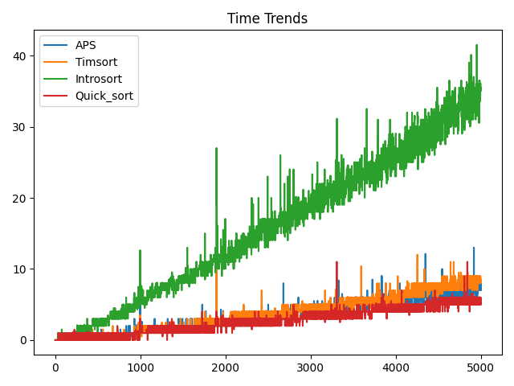

# Adaptive-Partition-Sort

> 💡 Currently Prepraing for the KIISE KSC 2023 and IEEE TC.

Adaptive Partition Sort (APS) is a hybrid sorting method that merges the strengths of Quick Sort and Merge Sort. APS adapts to
input data and a user-defined threshold, aiming for enhanced average-case performance while preserving stability and
time complexity.

Time Complexity   (APS/Timsort/introsort/quicksort)           |  Memory Complexity   (APS/Timsort/introsort/quicksort)  
:-------------------------:|:-------------------------:
 | 

| Time Performance Compared   (APS/Timsort/introsort/quicksort)           |  
|:-------------------------:|
|  | 
| Memory Performance Compared   (APS/Timsort/introsort/quicksort)  |
|  |

### Developed by:

- Ryan Donghan Kwon, Hana Academy Seoul (kznm.develop@gmail.com)
- DoHyun Lim, Korea Science Academy of KAIST (shiueo.csh@gmail.com)

### Research Contributers:
- Jeongyeon Park, Hana Academy Seoul.

### Special thanks to:

- [Jaeon Park](https://github.com/finalchild) for Validate APS algorithms and optimize algorithms of comparison 
